---
## Front matter
title: "Отчёт по лабораторной работе №4"
subtitle: "Дисциплина: архитектура компьютера"
author: "Ларина Наталья Денисовна"

## Generic otions
lang: ru-RU
toc-title: "Содержание"

## Bibliography
bibliography: bib/cite.bib
csl: pandoc/csl/gost-r-7-0-5-2008-numeric.csl

## Pdf output format
toc: true # Table of contents
toc-depth: 2
lof: true # List of figures
lot: true # List of tables
fontsize: 12pt
linestretch: 1.5
papersize: a4
documentclass: scrreprt
## I18n polyglossia
polyglossia-lang:
  name: russian
  options:
	- spelling=modern
	- babelshorthands=true
polyglossia-otherlangs:
  name: english
## I18n babel
babel-lang: russian
babel-otherlangs: english
## Fonts
mainfont: PT Serif
romanfont: PT Serif
sansfont: PT Sans
monofont: PT Mono
mainfontoptions: Ligatures=TeX
romanfontoptions: Ligatures=TeX
sansfontoptions: Ligatures=TeX,Scale=MatchLowercase
monofontoptions: Scale=MatchLowercase,Scale=0.9
## Biblatex
biblatex: true
biblio-style: "gost-numeric"
biblatexoptions:
  - parentracker=true
  - backend=biber
  - hyperref=auto
  - language=auto
  - autolang=other*
  - citestyle=gost-numeric
## Pandoc-crossref LaTeX customization
figureTitle: "Рис."
tableTitle: "Таблица"
listingTitle: "Листинг"
lofTitle: "Список иллюстраций"
lolTitle: "Листинги"
## Misc options
indent: true
header-includes:
  - \usepackage{indentfirst}
  - \usepackage{float} # keep figures where there are in the text
  - \floatplacement{figure}{H} # keep figures where there are in the text
---

# Цель работы

 Целью данной лабораторной работы является освоение процедуры и сборки программ, написанных на ассемблере NASM.
 
# Задание

1. Создание программы Hello, world!
2. Работа с траснслятором NASM
3. Работа с расширенным синтаксисом командой строки NASM
4. Работа с компоновщиками LD
5. Запуск исполняемого файла
6. Выполнение заданий для самостоятельной работы

# Теоретическое введение

 Основные принципы работы компьютера
 Основными функциональными элементами любой электронно-вычислительной машины
(ЭВМ) являются центральный процессор, память и периферийные устройства (рис. 4.1).
 Взаимодействие этих устройств осуществляется через общую шину, к которой они подклю-
чены. Физически шина представляет собой большое количество проводников, соединяющих
устройства друг с другом. В современных компьютерах проводники выполнены в виде элек-
тропроводящих дорожек на материнской (системной) плате.
 Основной задачей процессора является обработка информации, а также организация
координации всех узлов компьютера. В состав центрального процессора (ЦП) входят
следующие устройства:
	• арифметико-логическое устройство (АЛУ) — выполняет логические и арифметиче-
	ские действия, необходимые для обработки информации, хранящейся в памяти;
	• устройство управления (УУ) — обеспечивает управление и контроль всех устройств
	компьютера;
	• регистры — сверхбыстрая оперативная память небольшого объёма, входящая в со-
	став процессора, для временного хранения промежуточных результатов выполнения
	инструкций; регистры процессора делятся на два типа: регистры общего назначения и
	специальные регистры.
 Для того, чтобы писать программы на ассемблере, необходимо знать, какие регистры
процессора существуют и как их можно использовать. Большинство команд в программах
написанных на ассемблере используют регистры в качестве операндов. Практически все
команды представляют собой преобразование данных хранящихся в регистрах процессора,
это например пересылка данных между регистрами или между регистрами и памятью, пре-
образование (арифметические или логические операции) данных хранящихся в регистрах.

# Выполнение лабораторной работы
## Создание программы "Hello world!"

 С помощью утилиты cd перемещаюсь в каталог, в котором буду выполнять работу, и создаю в текущем каталоге пустой текстовый файл hello.asm с помощью утилиты touch (рис. [-@fig:001]).
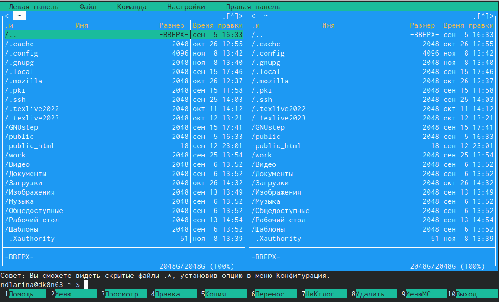{#fig:001 width=70%}

 Открываю созданный файл в текстовом редакторе gedit (рис. [-@fig:002]).
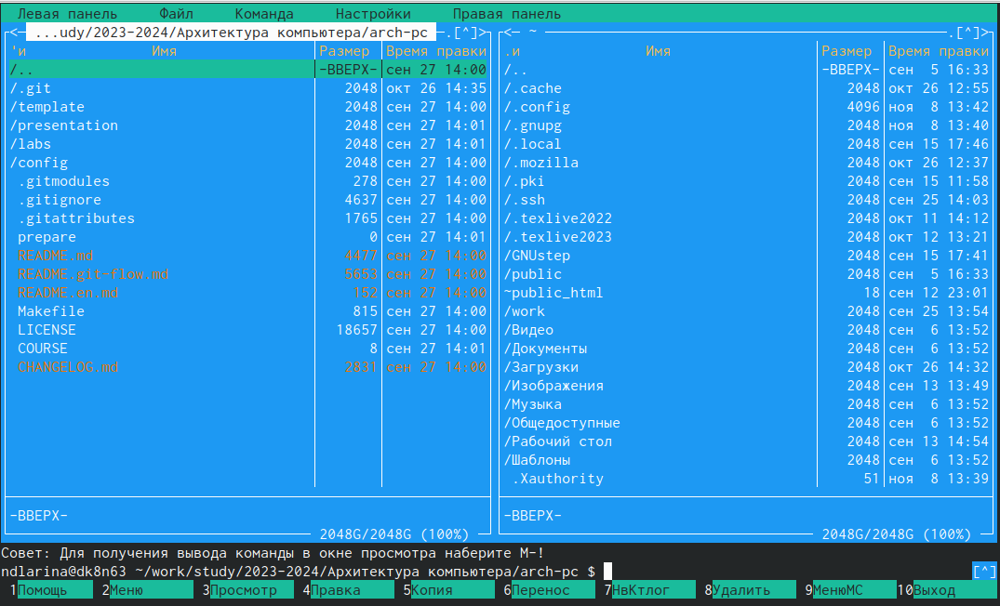{#fig:002 width=70%}

 Заполняю файл, вставляя в него программу "Hello world!" (рис. [-@fig:003]).
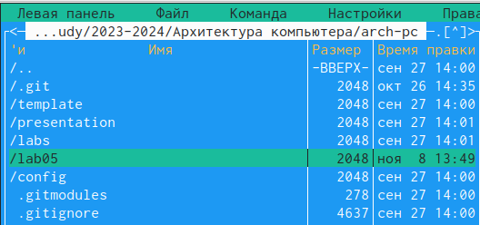{#fig:003 width=70%}

## Работа с транслятором NASM

 Превращаю текст программы для вывода "Hello world!" в объектный код с помощью транслятора NASM, используя команду nasm -f elf hello.asm, ключ -f ELF (рис. [-@fig:004]). Далее проверяю правильность выполнения команды с помощью утилиты ls.
 
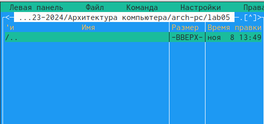{#fig:004 width=70%}

## Работа с расширенным синтаксисом командой строки NASM

 Сначала ввожу команду, которая скомпилирует файл hello.asm в файл obj.o, при этом в файл будут включены символы для отладки (ключ -g), также с помощью ключа -l будет создан файл листинга list.lst (рис. [-@fig:005]). И проверяю правильность выполнения команды, используя утилиту ls.
 
{#fig:005 width=70%}

## Работа с компоновщиками LD

 Передаю объектный файл hello.o на обработку компановщику LD, чтобы получить исполняемый файл hello (рис. [-@fig:006]). Ключ -о задаёт имя создаваемого исполняемого файла. затем проверяю правильность выполнения команды с помощью ls.
 
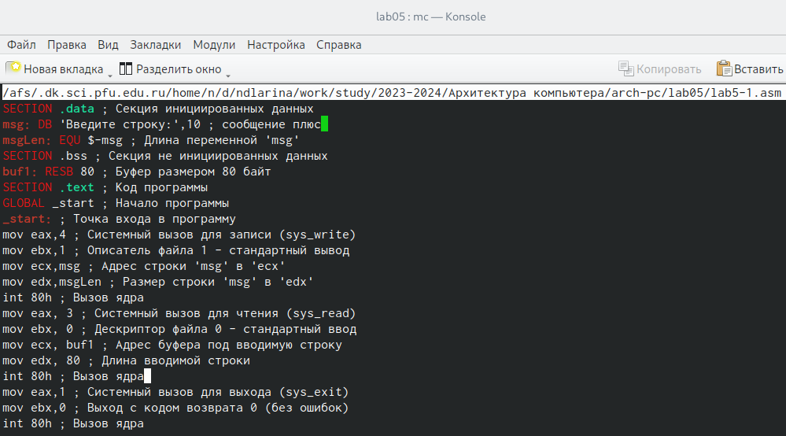{#fig:006 width=70%}

 Выполняю следующую команду (рис. [-@fig:007]). Исполняемый файл будет иметь имя main, так как после ключа -о было задано значение main. Объектный файл, из которого собран этот исполняемый файл, имеет имя obj.o.
 
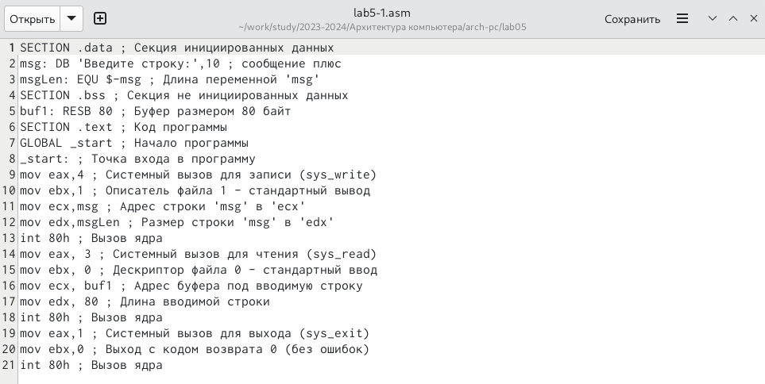{#fig:007 width=70%}

## Запуск исполняемого файла

 Запусаю на выполнение созданный исполняемый файл hello (рис. [-@fig:008]).
{#fig:008 width=70%}
 
## Выполнеие заданий для самостоятельной работы

 С помощью команды ср создаю в текущем каталоге копию файла hello.asm c именем lab4.asm (рис. [-@fig:009]).
 
{#fig:009 width=70%}

 Далее с помощью текстового редактора gedit открываю файл lab4.asm и вношу изменения в программу так, чтобы она выводила моё имя и фамилию (рис. [-@fig:010]).
 
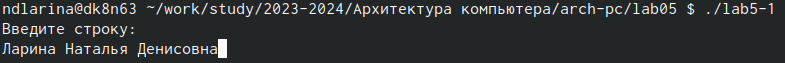{#fig:010 width=70%}

 Компилирую текст программы в объектный файл (рис. [-@fig:011]). И проверяю правильность выполнения команды с помощью утилиты ls.
 
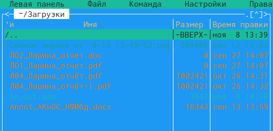{#fig:011 width=70%}

 Передаю объектный файл lab4.o на обработку компоновщику LD, чтобы получить исполняемый файл lab4 (рис. [-@fig:012]).

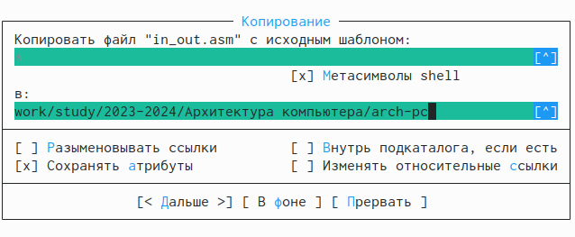{#fig:012 width=70%}

 Запускаю исполняемый файл lab4. Всё работает (рис. [-@fig:013]).
 
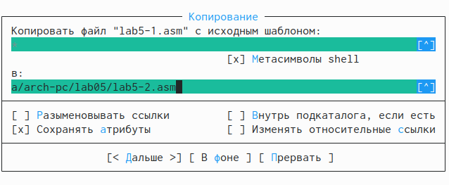{#fig:013 width=70%}

 Далее с помощью команд git add ., git commit и git push добавляю файлы на github, комментируя действие как добавление файлов для лабораторной работы №4, и затем отправляю файлы на сервер (рис. [-@fig:014]).
 
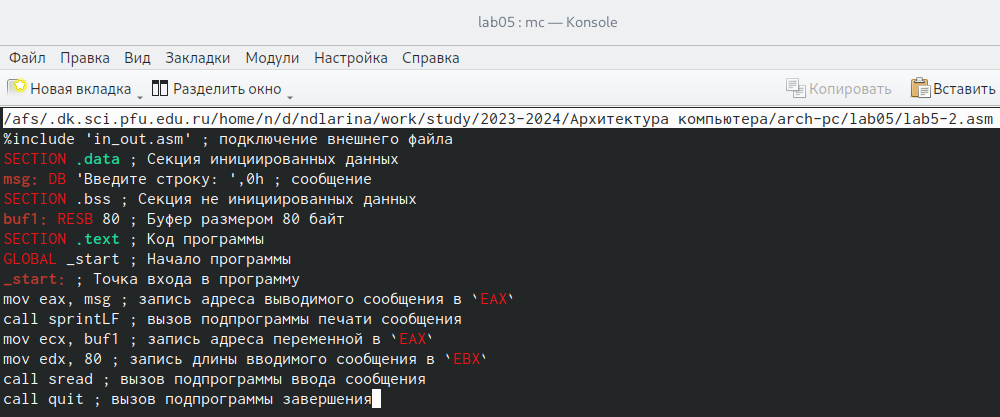{#fig:014 width=70%}
 
# Выводы

 В результате выполнения лабораторной работы мне удалось освоить процедуры компиляции и сборки программ, написанных на ассемблере NASM.

# Список литературы{.unnumbered}

1. https://esystem.rudn.ru/mod/resource/view.php?id=1030552
