---
## Front matter
title: "Отчёт по лабораторной работе №7"
subtitle: "Дисциплина: Архитектура компьютера"
author: "Ларина Наталья Денисовна"

## Generic otions
lang: ru-RU
toc-title: "Содержание"

## Bibliography
bibliography: bib/cite.bib
csl: pandoc/csl/gost-r-7-0-5-2008-numeric.csl

## Pdf output format
toc: true # Table of contents
toc-depth: 2
lof: true # List of figures
lot: true # List of tables
fontsize: 12pt
linestretch: 1.5
papersize: a4
documentclass: scrreprt
## I18n polyglossia
polyglossia-lang:
  name: russian
  options:
	- spelling=modern
	- babelshorthands=true
polyglossia-otherlangs:
  name: english
## I18n babel
babel-lang: russian
babel-otherlangs: english
## Fonts
mainfont: PT Serif
romanfont: PT Serif
sansfont: PT Sans
monofont: PT Mono
mainfontoptions: Ligatures=TeX
romanfontoptions: Ligatures=TeX
sansfontoptions: Ligatures=TeX,Scale=MatchLowercase
monofontoptions: Scale=MatchLowercase,Scale=0.9
## Biblatex
biblatex: true
biblio-style: "gost-numeric"
biblatexoptions:
  - parentracker=true
  - backend=biber
  - hyperref=auto
  - language=auto
  - autolang=other*
  - citestyle=gost-numeric
## Pandoc-crossref LaTeX customization
figureTitle: "Рис."
tableTitle: "Таблица"
listingTitle: "Листинг"
lofTitle: "Список иллюстраций"
lotTitle: "Список таблиц"
lolTitle: "Листинги"
## Misc options
indent: true
header-includes:
  - \usepackage{indentfirst}
  - \usepackage{float} # keep figures where there are in the text
  - \floatplacement{figure}{H} # keep figures where there are in the text
---

# Цель работы

Целью данной лабораторной работы является изучение команд условного и безусловного переходов. Приобретение навыков написания программ с использованием переходов. Знакомство с назначением и структурой файла листинга.  

# Задание

1. Реализация переходов в NASM.
2. Изучение структуры файлы листинга.
3. Задания для самостоятельной работы.

# Теоретическое введение

Для реализации ветвлений в ассемблере используются так называемые команды передачи управления или команды перехода. Можно выделить 2 типа переходов:  

• условный переход – выполнение или не выполнение перехода в определенную точку программы в зависимости от проверки условия.  

• безусловный переход – выполнение передачи управления в определенную точку программы без каких-либо условий.  

Безусловный переход выполняется инструкцией jmp. Инструкция cmp является одной из инструкций, которая позволяет сравнить операнды и выставляет флаги в зависимости от результата сравнения.  
Инструкция cmp является командой сравнения двух операндов и имеет такой же формат, как и команда вычитания.  

Листинг (в рамках понятийного аппарата NASM) — это один из выходных файлов, создаваемых транслятором. Он имеет текстовый вид и нужен при отладке программы, так как кроме строк самой программы он содержит дополнительную информацию.  

# Выполнение лабораторной работы

## Реализация переходов в NASM

Создаю каталог для программ лабораторной работы № 7, перехожу в него и создаю файл lab7-1.asm. (рис. @fig:001).  

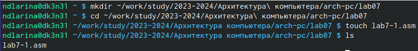{#fig:001 width=70%}  

Далее ввожу в файл lab7-1.asm текст программы из листинга 7.1. (рис. @fig:002).  

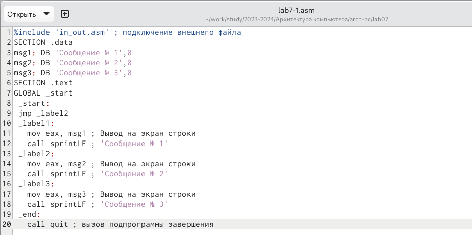{#fig:002 width=70%}  

Создаю исполняемый файл и запускаю его. (рис. @fig:003).  

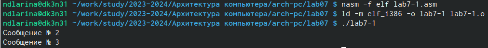{#fig:003 width=70%}  

Таким образом, использование инструкции jmp _label2 меняет порядок исполнения инструкций и позволяет выполнить инструкции, начиная с метки _label2, пропустив вывод первого сообщения.  

Изменю программу таким образом, чтобы она выводила сначала ‘Сообщение № 2’, потом ‘Сообщение № 1’ и затем завершала работу. Для этого изменяю текст программы в соответствии с листингом 7.2. (рис. @fig:004).  

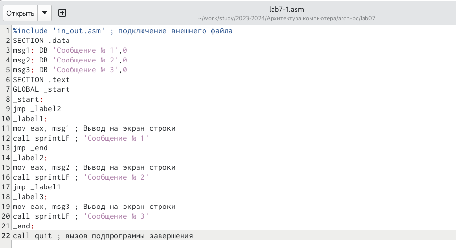{#fig:004 width=70%}  

Создаю исполняемый файл и проверяю его работу. (рис. @fig:005).  

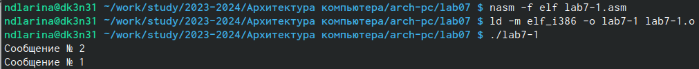{#fig:005 width=70%}  

Затем изменяю текст программы, добавив в начале программы jmp _label3, jmp _label2 в конце метки jmp _label3, jmp _label1 добавляю в конце метки jmp _label2, и добавляю jmp _end в конце метки jmp _label1, (рис. @fig:006).  

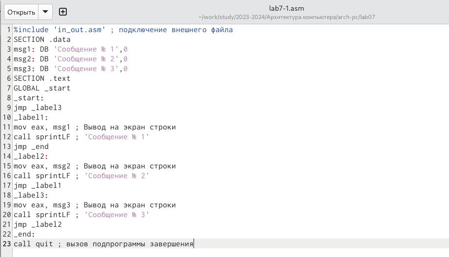{#fig:006 width=70%}  

Вывод программы получается следующим: (рис. @fig:007).  

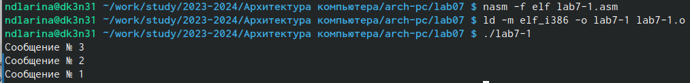{#fig:007 width=70%}  

Рассмотрим программу, которая определяет и выводит на экран наибольшую из 3 целочисленных переменных: A,B и C. Значения для A и C задаются в программе, значение B вводиться с клавиатуры.  

Создаю файл lab7-2.asm в каталоге ~/work/study/2023-2024/Архитектура\ компьютера/arch-pc/lab07. (рис. @fig:008).  

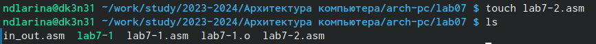{#fig:008 width=70%}  

Текст программы из листинга 7.3 ввожу в lab7-2.asm. (рис. @fig:009).  

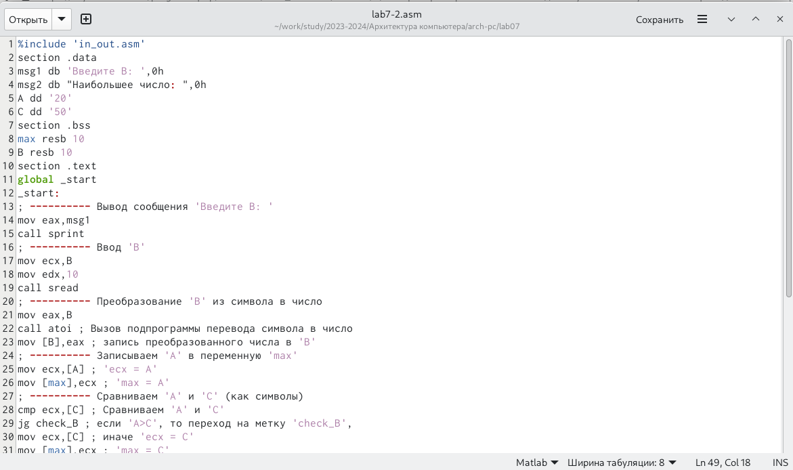{#fig:009 width=70%}  

Создаю исполняемый файл и проверяю его работу. (рис. @fig:010).  

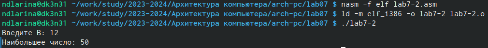{#fig:010 width=70%}  

Файл работает корректно.  

## Изучение структуры файлы листинга

Создаю файл листинга для программы из файла lab7-2.asm. (рис. @fig:011).  

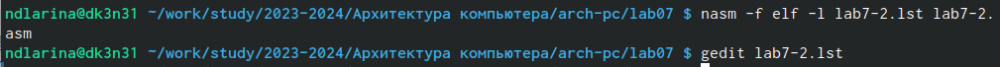{#fig:011 width=70%}  

Открываю файл листинга lab7-2.lst с помощью текстового редактора и внимательно изучаю его формат и содержимое. (рис. @fig:012).  

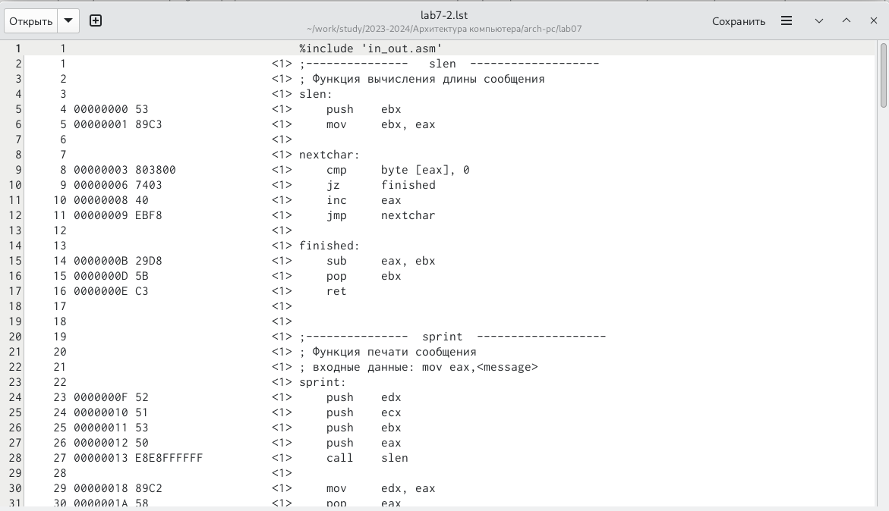{#fig:012 width=70%}  
 
В представленных трех строчках содержаться следующие данные: (рис. @fig:013).  

{#fig:013 width=70%}  

"2" - номер строки кода, "; Функция вычисления длинны сообщения" - комментарий к коду, не имеет адреса и машинного кода.  

"3" - номер строки кода, "slen" - название функции, не имеет адреса и машинного кода.  

"4" - номер строки кода, "00000000" - адрес строки, "53" - машинный код, "push ebx" - исходный текст программы, инструкция "push" помещает операнд "ebx" в стек.  

Открываю файл с программой lab7-2.asm и в выбранной мной инструкции с двумя операндами удаляю выделенный операнд. (рис. @fig:014).  

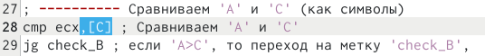{#fig:014 width=70%}  

Выполняю трансляцию с получением файла листинга. (рис. @fig:015).  

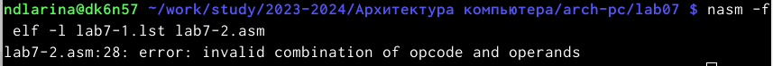{#fig:015 width=70%}  

На выходе я получаю ни одного файла из-за ошибки:инструкция mov (единственная в коде содержит два операнда) не может работать, имея только один операнд, из-за чего нарушается работа кода.  

## Задания для самостоятельной работы

1. Пишу программу нахождения наименьшей из 3 целочисленных переменных a, b и c. Значения переменных выбираю из табл. 7.5 в соответствии с вариантом, полученным при выполнении лабораторной работы № 6. Мой вариант под номером 6, поэтому мои значения - 79, 41 и 83. (рис. @fig:016).  

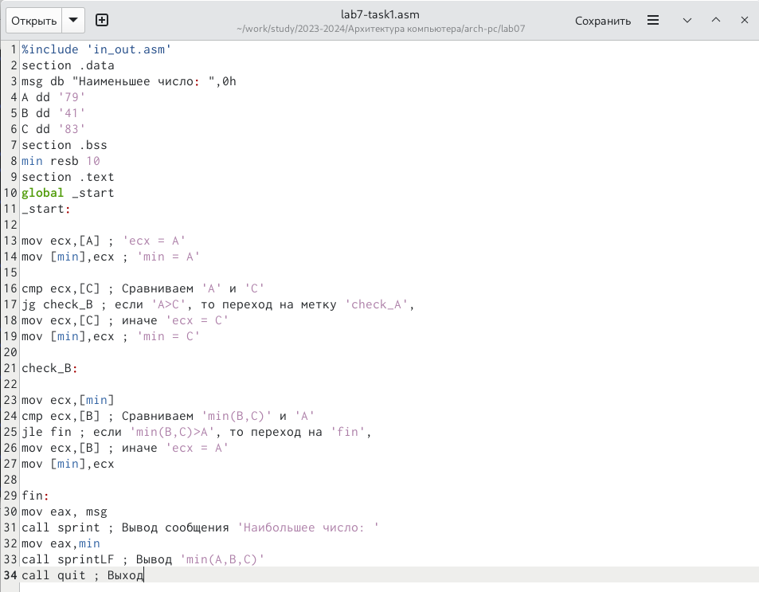{#fig:016 width=70%}  

Cоздаю исполняемый файл lab7-task1.asm. (рис. @fig:017).  

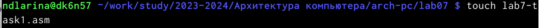{#fig:017 width=70%}  

И затем проверяю его работу, подставляя необходимые значение. (рис. @fig:018).  

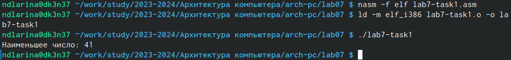{#fig:018 width=70%}  

Программа работает корректно.  

Код программы:  
%include 'in_out.asm'  
section .data  
msg db "Наименьшее число: ",0h  
A dd '79'  
B dd '41'  
C dd '83'  
section .bss  
min resb 10  
section .text  
global _start  
_start:

mov ecx,[A] ; 'ecx = A'  
mov [min],ecx ; 'min = A'  

cmp ecx,[C] ; Сравниваем 'A' и 'С'  
jg check_B ; если 'A>C', то переход на метку 'check_A',  
mov ecx,[C] ; иначе 'ecx = C'  
mov [min],ecx ; 'min = C'  

check_B:  

mov ecx,[min]
cmp ecx,[B] ; Сравниваем 'min(B,C)' и 'A'  
jle fin ; если 'min(B,C)>A', то переход на 'fin',  
mov ecx,[B] ; иначе 'ecx = A'  
mov [min],ecx  

fin:  
mov eax, msg  
call sprint ; Вывод сообщения 'Наибольшее число: '  
mov eax,min  
call sprintLF ; Вывод 'min(A,B,C)'  
call quit ; Выход  

# Выводы

В ходе работы над лабораторной работой я изучила команды условного и безусловного переходов, приобрела навыки написания программ с использованием переходов и ознакомилась с назначением и структурой файла листинга, что поможет мне при выполнении последующих лабораторных работ.  

# Список литературы

1. https://esystem.rudn.ru/mod/resource/view.php?id=1030555  
