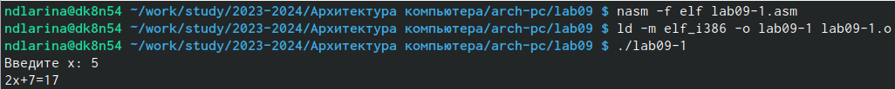
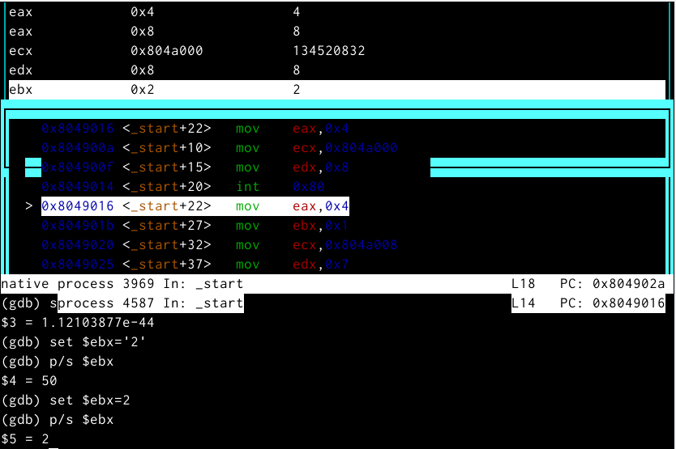
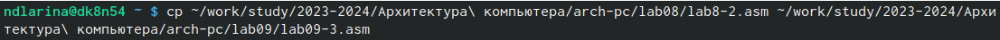

---
## Front matter
title: "Отчёт по лабораторной работе №9"
subtitle: "Дисциплина: Архитектура компьютера"
author: "Ларина Наталья Денисовна"

## Generic otions
lang: ru-RU
toc-title: "Содержание"

## Bibliography
bibliography: bib/cite.bib
csl: pandoc/csl/gost-r-7-0-5-2008-numeric.csl

## Pdf output format
toc: true # Table of contents
toc-depth: 2
lof: true # List of figures
lot: true # List of tables
fontsize: 12pt
linestretch: 1.5
papersize: a4
documentclass: scrreprt
## I18n polyglossia
polyglossia-lang:
  name: russian
  options:
	- spelling=modern
	- babelshorthands=true
polyglossia-otherlangs:
  name: english
## I18n babel
babel-lang: russian
babel-otherlangs: english
## Fonts
mainfont: PT Serif
romanfont: PT Serif
sansfont: PT Sans
monofont: PT Mono
mainfontoptions: Ligatures=TeX
romanfontoptions: Ligatures=TeX
sansfontoptions: Ligatures=TeX,Scale=MatchLowercase
monofontoptions: Scale=MatchLowercase,Scale=0.9
## Biblatex
biblatex: true
biblio-style: "gost-numeric"
biblatexoptions:
  - parentracker=true
  - backend=biber
  - hyperref=auto
  - language=auto
  - autolang=other*
  - citestyle=gost-numeric
## Pandoc-crossref LaTeX customization
figureTitle: "Рис."
tableTitle: "Таблица"
listingTitle: "Листинг"
lofTitle: "Список иллюстраций"
lotTitle: "Список таблиц"
lolTitle: "Листинги"
## Misc options
indent: true
header-includes:
  - \usepackage{indentfirst}
  - \usepackage{float} # keep figures where there are in the text
  - \floatplacement{figure}{H} # keep figures where there are in the text
---

# Цель работы

Приобретение навыков написания программ с использованием подпрограмм. Знакомство с методами отладки при помощи GDB и его основными возможностями.  

# Задание

1. Реализация подпрограмм в NASM.  
2. Отладка программам с помощью GDB.  
3. Добавление точек останова.  
4. Работа с данными программы в GDB.  
5. Обработка аргументов командной строки в GDB.  
6. Задания для самостоятельной работы.  

# Теоретическое введение

Отладка — это процесс поиска и исправления ошибок в программе. В общем случае его можно разделить на четыре этапа:
• обнаружение ошибки;
• поиск её местонахождения;
• определение причины ошибки;
• исправление ошибки.
Можно выделить следующие типы ошибок:
• синтаксические ошибки — обнаруживаются во время трансляции исходного кода и
вызваны нарушением ожидаемой формы или структуры языка;
• семантические ошибки — являются логическими и приводят к тому, что программа
запускается, отрабатывает, но не даёт желаемого результата;
• ошибки в процессе выполнения — не обнаруживаются при трансляции и вызывают пре-
рывание выполнения программы (например, это ошибки, связанные с переполнением
или делением на ноль).
Второй этап — поиск местонахождения ошибки. Некоторые ошибки обнаружить довольно трудно. Лучший способ найти место в программе, где находится ошибка, это разбить программу на части и произвести их отладку отдельно друг от друга.
Третий этап — выяснение причины ошибки. После определения местонахождения ошибки обычно проще определить причину неправильной работы программы.
Последний этап — исправление ошибки. После этого при повторном запуске программы, может обнаружиться следующая ошибка, и процесс отладки начнётся заново.

GDB (GNU Debugger — отладчик проекта GNU) [1] работает на многих UNIX-подобных системах и умеет производить отладку многих языков программирования. GDB предлагает обширные средства для слежения и контроля за выполнением компьютерных программ. Отладчик не содержит собственного графического пользовательского интерфейса и использует стандартный текстовый интерфейс консоли. Однако для GDB существует несколько сторон- них графических надстроек, а кроме того, некоторые интегрированные среды разработки используют его в качестве базовой подсистемы отладки.

# Выполнение лабораторной работы

## Реализация подпрограмм в NASM

Создаю каталог для выполнения лабораторной работы №9, перехожу в него и создаю файл lab09-1.asm. (рис. @fig:001)  

{#fig:001 width=70%}  

Ввожу в файл lab09-1.asm текст программы с использованием подпрограммы из листинга 9.1. (рис. @fig:002)  

{#fig:002 width=70%}  

Создаю исполняемый файл и проверяю его работу. (рис. @fig:003)  

{#fig:003 width=70%}  

Изменяю текст программы, добавив подпрограмму _subcalcul в подпрограмму _calcul для вычисления выражения f(g(x)), где x вводится с клавиатуры, f(x) = 2x + 7, g(x) = 3x − 1. (рис. @fig:004)  

{#fig:004 width=70%}  

Создаю исполняемый файл и проверяю его работу. (рис. @fig:005)  

{#fig:005 width=70%}  
 
## Отладка программам с помощью GDB

Создаю файл lab09-2.asm с текстом программы из Листинга 9.2. (рис. @fig:006)  

{#fig:006 width=70%}  

Получаю исполняемый файл для работы с GDB с ключом ‘-g’. (рис. @fig:007)  

{#fig:007 width=70%}  

Загружаю исполняемый файл в отладчик gdb. (рис. @fig:008)  

{#fig:008 width=70%}  

Проверяю работу программы, запустив ее в оболочке GDB с помощью команды run. (рис. @fig:009)  

{#fig:009 width=70%}  

Для более подробного анализа программы устанавливаю брейкпоинт на метку _start и запускаю её. (рис. @fig:010)  

{#fig:010 width=70%}  

Просматриваю дисассимилированный код программы с помощью команды disassemble, начиная с метки _start, и переключаюсь на отображение команд с синтаксисом Intel, введя команду set disassembly-flavor intel. (рис. @fig:011)  

{#fig:011 width=70%}  

В режиме ATT имена регистров начинаются с символа %, а имена операндов с $, в то время как в Intel используется привычный нам синтаксис.  

Включаю режим псевдографики для более удобного анализа программы с помощью команд layout asm и layout regs. (рис. @fig:012)  

{#fig:012 width=70%}  

### Добавление точек останова

Проверяю, что точка останова по имени метки _start установлена с помощью команды info breakpoints и устанавливаю еще одну точку останова по адресу инструкции mov ebx,0x0. Просматриваю информацию о всех установленных точках останова. (рис. @fig:013)  

{#fig:013 width=70%}  

### Работа с данными программы в GDB

Выполняю 5 инструкций с помощью команды stepi и слежу за изменением значений регистров. (рис. @fig:001)  

{#fig:014 width=70%}  

Изменились значения регистров eax, ecx, edx и ebx.  

Далее просматриваю значение переменной msg1 по имени с помощью команды x/1sb &msg1 и значение переменной msg2 по ее адресу. (рис. @fig:015)  

{#fig:015 width=70%}  

С помощью команды set изменяю первый символ переменной msg1 и заменяю первый символ в переменной msg2. (рис. @fig:016)  

{#fig:016 width=70%}  

Затем вывожу в шестнадцатеричном формате, в двоичном формате и в символьном виде соответственно значение регистра edx с помощью команды print p/F $val. И с помощью команды set изменяю значение регистра ebx в соответствии с заданием. (рис. @fig:017)  

{#fig:017 width=70%}  

Разница вывода команд p/s $ebx отличается тем, что в первом случае мы переводим символ в его строковый вид, а во втором случае число в строковом виде не изменяется.  

Завершаю выполнение программы с помощью команды continue и выхожу из GDB с помощью команды quit. (рис. @fig:018)  

{#fig:018 width=70%}  
 
### Обработка аргументов командной строки в GDB

Копирую файл lab8-2.asm с программой из листинга 8.2 в файл с именем lab09-3.asm (рис. @fig:019)  

{#fig:019 width=70%}  

И затем создаю исполняемый файл. (рис. @fig:020)  

{#fig:020 width=70%}  

Загружаю исполняемый файл в отладчик gdb, указывая необходимые аргументы с использованием ключа --args. (рис. @fig:021)  

{#fig:021 width=70%}  

Устанавливаю точку останова перед первой инструкцией в программе и запускаю ее. (рис. @fig:022)  

{#fig:022 width=70%}  

Посматриваю вершину стека и позиции стека по их адресам. (рис. @fig:023)  

{#fig:023 width=70%}  

Шаг изменения адреса равен 4, т.к количество аргументов командной строки равно 4.  

## **Задания для самостоятельной работы**

1. Преобразовываю программу из лабораторной работы №8 (Задание №1 для самостоятельной работы), реализовав вычисление значения функции f(x) как подпрограмму. (рис. @fig:024)  

{#fig:024 width=70%}  

Запускаю код и проверяю, что она работает корректно. (рис. @fig:025)  

{#fig:025 width=70%}  

2. Ввожу в файл lab09-task2.asm текст программы из листинга 9.3. (рис. @fig:026)  

{#fig:026 width=70%}  

При корректной работе программы должно выводится "25". Создаю исполняемый файл и запускаю его. (рис. @fig:027)  

{#fig:027 width=70%}  

Видим, что в выводе мы получаем неправильный ответ.  

Получаю исполняемый файл для работы с GDB, запускаю его и ставлю брейкпоинты для каждой инструкции, связанной с вычислениями. С помощью команды continue прохожусь по каждому брейкпоинту и слежу за изменениями значений регистров.  

При выполнении инструкции mul ecx происходит умножение ecx на eаx, то есть 4 на 2, вместо умножения 4 на 5 (регистр ebx). Происходит это из-за того, что стоящая перед mov ecx,4 инструкция add ebx,eax не связана с mul ecx, но связана инструкция mov eax,2. (рис. @fig:028)  

{#fig:028 width=70%}  

Из-за этого мы получаем неправильный ответ. (рис. @fig:029)  

{#fig:029 width=70%}  

Исправляем ошибку, добавляя после add ebx,eax mov eax,ebx и заменяя ebx на eax в инструкциях add ebx,5 и mov edi,ebx. (рис. @fig:030)  

{#fig:030 width=70%}  

Также, вместо того, чтобы изменять значение еах, можно было изменять значение неиспользованного регистра edx.  

Создаем исполняемый файл и запускаем его. Убеждаемся, что ошибка исправлена. (рис. @fig:031)  

{#fig:031 width=70%}  

# Выводы

В ходе работы над данной лабораторной работы мне удалось приобрести навыки написания программ с использованием подпрограмм и ознакомилась с методами отладки при помощи GDB и его основными возможностями.  

# Список литературы

1. [Лабораторная работа №9](https://esystem.rudn.ru/mod/resource/view.php?id=1030557)  
